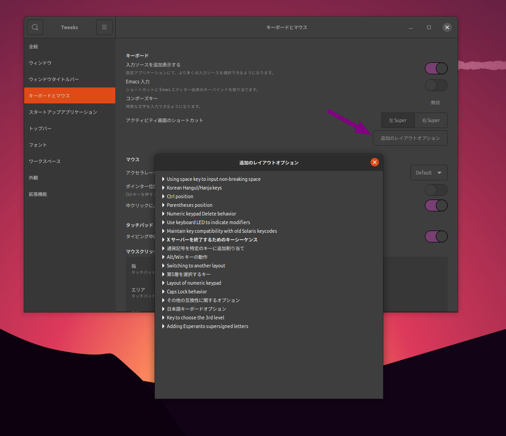
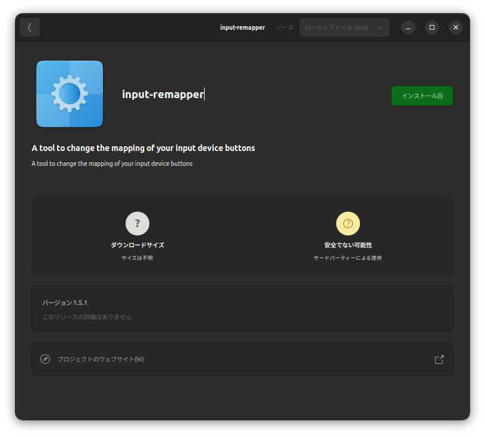
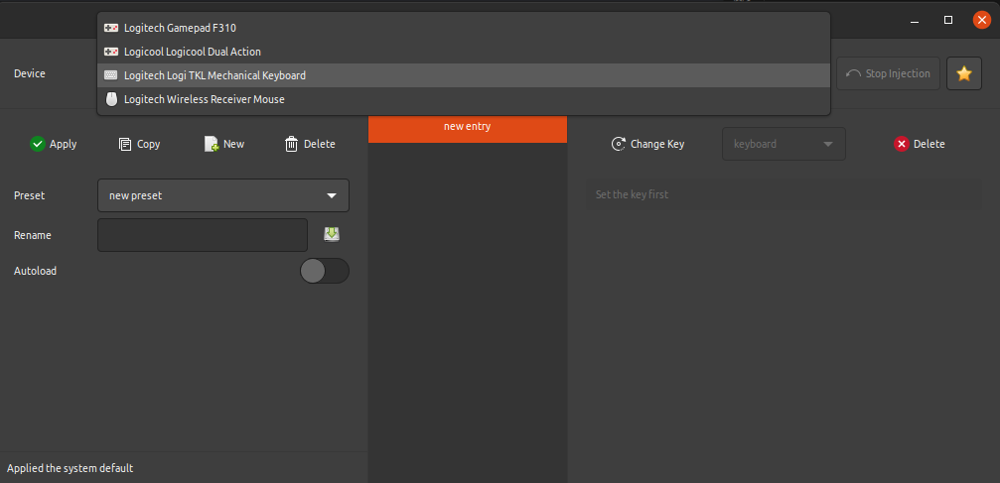

# キーボードカスタマイズユーティリティ🎮 ⌨ の選択ガイド

私は日々の作業においてLogicoolのK835 TKLキーボードを利用しています。
このキーボードは元々日本語配列でしたが、9009 XDA ヴィンテージ PBTキーキャップセットを利用してキーキャップを交換し、英語配列に切り替えることにしました。

しかし、この変更により、英語配列にはないいくつかのキーが生まれ、残念ながらこれらのキーはデフォルトの状態では反応しませんでした。

これらのキーを活用するために、特定のキーに機能を割り当てることができるユーティリティを探し始めました。

この記事では、多くのキーボードカスタマイズユーティリティの特徴と適用範囲を整理し、採用した**input-remapper**について詳しく解説します。


## 環境
```bash
cat /etc/lsb-release
DISTRIB_ID=Ubuntu
DISTRIB_RELEASE=20.04
DISTRIB_CODENAME=focal
DISTRIB_DESCRIPTION="Ubuntu 20.04.6 LTS"
```

- [キーボードカスタマイズユーティリティ🎮 ⌨ の選択ガイド](#キーボードカスタマイズユーティリティ--の選択ガイド)
  - [環境](#環境)
  - [確認ポイント](#確認ポイント)
  - [確認ポイントの具体的な説明](#確認ポイントの具体的な説明)
    - [1. 使用する環境を確認する:](#1-使用する環境を確認する)
    - [2. 再現の容易さを考慮する:](#2-再現の容易さを考慮する)
    - [3. 目的を明確にする:](#3-目的を明確にする)
    - [4. GUIエディタの利用:](#4-guiエディタの利用)
    - [5. 学習曲線:](#5-学習曲線)
  - [注意点](#注意点)
  - [**input-remapper**について](#input-remapperについて)
    - [アーキテクチャ](#アーキテクチャ)
    - [使い方](#使い方)
    - [例](#例)
    - [設定ファイルの保存場所](#設定ファイルの保存場所)
      - [設定ファイルの内容](#設定ファイルの内容)
  - [まとめ](#まとめ)

## 確認ポイント
キーボードカスタマイズユーティリティを選択する際に、以下の確認ポイントを考慮するとよいでしょう。

1. **使用する環境を確認する**:
    - X11のみ: xmodmap, xkb, AutoKey, Key Mapper, xkeycaps
    - Waylandのみ: 
    - X11とWaylandの両方: Interception Tools, **input-remapper**, GNOME Tweaks

2. **再現の容易さを考慮する**:
    - スクリプトベースで再現可能: xmodmap, xkb, Interception Tools
    - GUIエディタで設定をエクスポート/インポート可能かつスクリプトベースで再現可能: AutoKey, Key Mapper, xkeycaps, **input-remapper**

3. **目的を明確にする**:
    - モディファイアキーの入れ替えのみ: xmodmap, xkb, GNOME Tweaks
    - キーの再配置: xmodmap, xkb, Key Mapper, xkeycaps, **input-remapper**
    - マクロ作成: AutoKey, Interception Tools, **input-remapper**

4. **GUIエディタの利用**:
    - GUIエディタで編集可能: AutoKey, Key Mapper, GNOME Tweaks, xkeycaps, **input-remapper**
    - GUIエディタで編集不可能: xmodmap, xkb, Interception Tools

5. **学習曲線**:
    - 容易: xmodmap, AutoKey, Key Mapper, GNOME Tweaks, xkeycaps, **input-remapper**
    - 難しい: xkb, Interception Tools

6. **追加の高度な機能**:
    - 高度な機能が必要: xkb, Interception Tools, **input-remapper**
    - 基本的な機能で十分: xmodmap, AutoKey, Key Mapper, GNOME Tweaks, xkeycaps

※Wayland環境での`GNOME Tweaks`のキーボードリマッピング機能の制限については、未確認。

その他のユーティリティについては、以下を参照して下さい。

https://wiki.archlinux.jp/index.php/%E5%85%A5%E5%8A%9B%E3%83%AA%E3%83%9E%E3%83%83%E3%83%97%E3%83%A6%E3%83%BC%E3%83%86%E3%82%A3%E3%83%AA%E3%83%86%E3%82%A3


## 確認ポイントの具体的な説明

### 1. 使用する環境を確認する:
使用するディスプレイマネージャー環境により、どのユーティリティが利用可能か変わります。

たとえば、xmodmapやxkeycapsはX11専用です。しかし、Interception Toolsや**input-remapper**はX11とWaylandの両方で利用できます。また、GNOME TweaksもX11とWaylandの両方で動作可能な可能性がありますが、Wayland環境ではキーボードリマッピング機能に制限があるかもしれません。

### 2. 再現の容易さを考慮する:
システムを再インストールする際や、設定を他のコンピューターに移行する際、再現の容易さが重要です。

スクリプトベースのユーティリティは、設定をテキストファイルとして保存し、簡単に環境復元できます。一方で、GUIエディタを使用するユーティリティの中には、エクスポートとインポートの機能を提供するものがあり、設定の再現も容易に行えます。

### 3. 目的を明確にする:
キーボードカスタマイズの目的は多岐にわたります。

モディファイアキーの入れ替え、キーの再配置、マクロの作成など、それぞれの目的に対して最適なユーティリティがあります。例えば、xmodmapやxkbはキーの再配置やモディファイアキーの入れ替えに優れており、AutoKeyやInterception Toolsはマクロ作成に強いです。**input-remapper**はキーの再配置とマクロ作成の両方に利用できます。

### 4. GUIエディタの利用:
GUIエディタはキーボードカスタマイズのプロセスを簡単かつ視覚的に行えますが、GUIエディタで編集可能なユーティリティとGUIエディタで編集不可能なユーティリティがあります。

GUIエディタで編集可能なユーティリティにはAutoKey, Key Mapper, GNOME Tweaks, xkeycaps, および **input-remapper**があり、直感的にキーボード設定を変更できます。一方、GUIエディタで編集不可能なユーティリティにはxmodmap, xkb, および Interception Toolsがあり、これらはコマンドラインやテキストエディタを使って設定を行います。

### 5. 学習曲線:
キーボードカスタマイズユーティリティは、学習曲線が異なります。

容易に学べるユーティリティにはxmodmap, AutoKey, Key Mapper, GNOME Tweaks, xkeycaps, および **input-remapper**があります。一方で、xkbやInterception Toolsは学習曲線が急であり、高度な機能を利用するためにはより多くの学習が必要です。

利用目的と取れる時間に応じて、ユーティリティを選択することが重要です。

## 注意点
- GNOME Tweaksの`キーボードとマウス　→　キーボード　→　追加のレイアウト`を一度確認しておくとよい。ここで設定できるならこれが一番簡単。

  GNOME Tweaksでキーボードの設定を変更する前に、あらかじめ
  ```bash
  dconf watch /
  ```
  を実行しておくと、後々、gsettingsで設定を再現する際に便利です。

  

- xmodmapはfcitxと相性が悪く、`.xmodmap`の設定はfcitxの切替時に無効化されてしまいます。

https://aaa555.hatenablog.com/entry/20151102/p1

https://unix.stackexchange.com/questions/292868/how-to-customise-keyboard-mappings-with-wayland

> Wayland のセキュリティモデルでは、コンポジタ以外のプログラムが生のキーボード入力を取得できません。一部のコンポジタはキーのリマップをサポートしていますが (例えば、gnome-tweaks で mutter を使う)、その数は多くありません。ユーティリティは、コンポジタよりも前にキーボード入力を取得し、キーボード入力を修正してコンポジタに渡すことで、この問題を回避します。

https://wiki.archlinux.jp/index.php/%E5%85%A5%E5%8A%9B%E3%83%AA%E3%83%9E%E3%83%83%E3%83%97%E3%83%A6%E3%83%BC%E3%83%86%E3%82%A3%E3%83%AA%E3%83%86%E3%82%A3

## **input-remapper**について

https://github.com/sezanzeb/**input-remapper**

https://qiita.com/j0306043/items/fcc9546056eeca5b025a#%E3%82%AD%E3%83%BC%E3%83%90%E3%82%A4%E3%83%B3%E3%83%89%E3%81%AE%E5%A4%89%E6%9B%B4-wayland%E7%B7%A8

`**input-remapper**`は、キーボードやマウスのボタンを再マッピングするためのツールで、X11およびWaylandの両方をサポートしています。

このツールは、あらゆる入力を他の任意の入力にマッピングでき、プログラム可能なマクロ、ジョイスティック、ホイール、トリガー、キー、マウスの動きなどをサポートしています。

Ubuntu 22.04の場合、`**input-remapper**`はUbuntuの公式リポジトリにも含まれており、パッケージ名は`**input-remapper**`となっています。ver. 1.4.0-1がインストールされます。

https://packages.ubuntu.com/jammy/**input-remapper**

```bash
sudo apt -y install **input-remapper**
```

最新の2.0以降をインストールしたい場合は、GitHubからインストールする必要があります。

https://github.com/sezanzeb/**input-remapper**/releases

Ubuntu 20.04の場合は、ver. 1.5.1が最終バージョンです。

https://github.com/sezanzeb/**input-remapper**/releases/tag/1.5.1

debファイルをダウンロードした後、**input-remapper**-1.5.1.debをダブルクリックすると、Ubuntuソフトウェアでインストールできます。




起動には管理者権限が必要です。



### アーキテクチャ


### 使い方
https://github.com/sezanzeb/**input-remapper**/blob/HEAD/readme/usage.md

### 例
https://github.com/sezanzeb/**input-remapper**/blob/a012746a6b3d842943613fe80461bf50be3bc01d/readme/examples.md

### 設定ファイルの保存場所
`$HOME/.config/**input-remapper**/`以下に設定ファイルが保存されます。
再インストールの際、このディレクトリ以下をバックアップしておくとよいでしょう。

#### 設定ファイルの内容
config.json
```json
{
    "version": "1.5.1",
    "autoload": {
        "Logitech Logi TKL Mechanical Keyboard": "2023-10-20"
    },
    "macros": {
        "keystroke_sleep_ms": 10
    }
}
```
2023-10-20.json（作成されたプリセット）
```json
{
    "mapping": {
        "1,124,1": [
            "BackSpace",
            "keyboard"
        ],
        "1,93,1": [
            "Alt_R",
            "keyboard"
        ]
    }
}
```

## まとめ

キーボードのカスタマイズは作業効率を向上させる重要なステップであり、本記事では複数のキーボードカスタマイズユーティリティを検討し、**input-remapper**の利用方法を深く探りました。

選択肢は多岐にわたるため、個人のニーズや使用環境に応じて最適なツールを選ぶことが重要です。

**input-remapper**は、特にUbuntuユーザーにとって、キーボードの再マッピングとマクロ作成の両方に強力なツールであり、簡単に取り入れることができます。

この記事で、キーボードのカスタマイズがどれほど容易かつ効果的であるかを共有し、読者の皆さんにも自身の作業環境を最適化する手助けを提供できればと思います。

以上です。ありがとうございました。